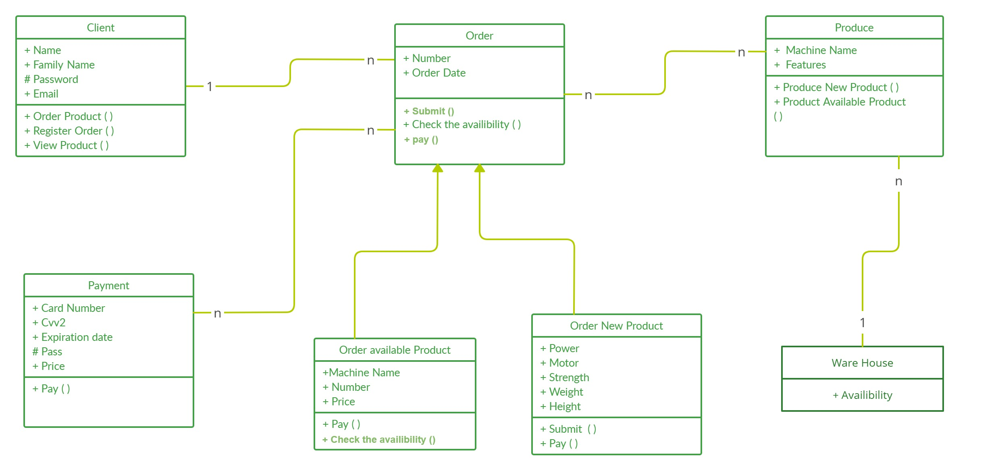

## **Warehouse and Ordering Web Application**

This repository contains the code for a Warehouse and Ordering Web Application. Below is an overview of the project structure, including class diagrams and explanations of how the code works.

### **Summary:**

The project involves the development of a web application for managing warehouse inventory and ordering products. It includes features for user registration, login authentication, inventory management for administrators, product ordering for managers, and a shopping section for users.

### **Class Diagram:**

Below is the class diagram for the project:

  
     &nbsp; &nbsp; 
    
 &nbsp; &nbsp;

### **Explanation of Code Flow:**

1. **DataBase.cs**: Defines three structs for user, manager, and product, each containing arrays and variables for storing relevant information.

2. **User Authentication**:
   - If a user attempts to login without registering, an error message prompts them to register first.
   - Three predefined managers are identified with usernames and passwords. User credentials are checked during login.

3. **Warehouse Inventory Management**:
   - Administrators can add or remove products from the warehouse inventory.
   - Managers can view the availability of products, add new products, or remove existing ones.

4. **User Registration and Login**:
   - Users must first register before accessing the shopping section.
   - Error messages are displayed if any required information is missing during registration.
   - Captcha functionality is implemented for additional security.

5. **Ordering Section**:
   - Users can order new or existing products.
   - Availability of products is checked before processing the order.
   - Total price calculation is performed based on selected products and quantities.

6. **Payment Processing**:
   - Payment form is displayed after confirming the order.
   - Validation checks are performed on payment details.
   - If it is a brand new product upon submission, a message is displayed, instructing the user to contact for further design and information.

### **Conclusion:**

This project implements a comprehensive web application for warehouse management and product ordering. It includes user authentication, inventory management, ordering functionality, and payment processing. 

## License

This project is licensed under the [MIT License](LICENSE).
